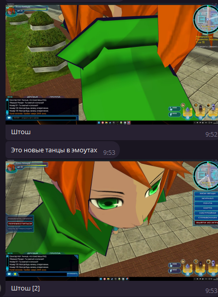

# Bug 26 — Новые танцы и деформация одежды в эмоциях

**Приоритет:** P1. **Статус:** код исправлен 2026-10-01; 30 адресных тестов и 60 GPU-сценариев прошли. Снято из активной очереди как code-fixed; игровая приёмка двух клиентов не подтверждена.

## Объём и свидетельства

- [T058](../../source-list.md#t058) — Не работают добавленные в ретробьюшене эмоуты игрока
- [T062](../../source-list.md#t062) — Новые танцы сломаны
- [T065](../../source-list.md#t065) — Одежда странно изгибается при использовании эмоций.

На скриншоте камера оказывается вплотную к сильно увеличенным/деформированным фрагментам персонажа. Причина экспорта предполагается пользователем, но ещё не установлена.

[Предыдущая карточка и результаты](../2026-09-30/bug-026.md). Прежние исправленные части не входят в активный объём.

## Точки входа

- [crates/ffone-client/src/characters/player_shared_rig](../../../../crates/ffone-client/src/characters/player_shared_rig)
- [crates/ffone-client/src/tutorial_runtime/player_presentation](../../../../crates/ffone-client/src/tutorial_runtime/player_presentation)
- [crates/ffone-client/src/ui/gameplay/quick_chat.rs](../../../../crates/ffone-client/src/ui/gameplay/quick_chat.rs)

Сначала поиск символов, затем чтение совпавших диапазонов. Для серверного результата найти владельца в `../RustyFusion` и прочитать его AGENTS.md перед изменением. Контракты и порядок выполнения — в [AGENTS.md](../../AGENTS.md).

## Задание агенту

Числовой маршрут 31–44 уже добавлен: сначала установить точный emote ID/клип, который даёт кадры примера. Проверить оба пола, root motion/масштаб, bind pose, соответствие костей и skin weights одежды. Если доказан дефект экспорта исходного клипа/рига, прочитать ../FusionForge/AGENTS.md и указанный там reverse-engineering skill, исправить владельца экспорта в FusionForge и адресно обновить native assets/game. Не добавлять конвертер в FFOneClient.

## Критерий готовности и проверка

Каждый затронутый танец в реальном клиенте не растягивает тело/одежду, не двигает камеру внутрь модели, завершается и прерывается; второй клиент видит тот же клип. Старые ID и варианты сохранены.

Проверить только затронутый сценарий и подходящие уникальные регрессии. Для новых UI/графики/анимаций/аудио нужен реальный клиент; для обмена/удалённого аватара — два клиента и сервер. Нулевой набор тестов не подтверждает результат. Если необходимый запуск недоступен, явно оставить живую приёмку неподтверждённой.

## Результат выполнения

### 2026-10-01 — конфликт масштаба в native графе

- Все четырнадцать клипов кодов 31–44 (`ffr_dance_02` … `ffr_emote_idolpose`) обоих полов содержат абсолютные scale-каналы на 19 костях, которыми одновременно управляют `height`/`shape`. В `body_composition` Bevy складывает scale-векторы движения и пропорций: единица из танца прибавляется к масштабу тела на каждой кости. По цепочке иерархии это многократно увеличивает тело и одежду. Скриншот не позволяет установить единственный исходный код; проверка охватывает весь диапазон.
- Исправлен `animation_prepare_tutorial_player_animation_adapter.rs`: копия motion-клипа исключает только scale-свойства, принадлежащие слою пропорций. Translation/rotation, duration/events, остальные scale-каналы и исходные GLTF sub-assets сохраняются. Переходы и числовые ID не менялись. Загрузка ждёт наличия всех motion sub-assets перед подготовкой копий.
- Экспортный дефект для этого увеличения не требуется: ошибку вызывает native композиция абсолютных scale-кривых. `assets/game` и FusionForge не изменялись. Удалённый персонаж использует обычный граф без этой additive-композиции пропорций; сетевой путь не менялся.
- Добавлена регрессия `emote_motion_preserves_body_scale_ownership_in_bevy_graph`: реальный AnimationPlugin, исходный и исправленный графы, три набора пропорций; сохранение перемещения/поворота и масштаба независимого socket. GPU preview принимает `FFONE_CUSTOM_EMOTE_CODE=31..44`, проверяет масштаб/границы костей, снимок, завершение либо прерывание через `FFONE_CUSTOM_EMOTE_INTERRUPT=1`.
- Проверено: `target/debug/deps/ffone_client-c2ceebe582f346b8.exe tutorial_runtime::player_rig_runtime::tests --nocapture` — **30 passed**, включая новую регрессию с исходным и исправленным графами. Исходный граф реально даёт `proportions + Vec3::ONE`, исправленный — `proportions`; перемещение, поворот и независимый socket сохраняются.
- GPU: `tutorial_player_rig_gpu_preview-bug026.exe assets/game OUTPUT.png 2 1 0 dance male|female`, `FFONE_CUSTOM_EMOTE_CODE=31..44` — **28/28** точных клипов завершились в `stand1`. Тот же набор с `FFONE_CUSTOM_EMOTE_INTERRUPT=1` — **28/28** прервались движением в `run`. Ещё **4/4**: оба пола, код 31 при height/body 0/0 и код 44 при 4/2. Проверки масштаба и положения костей во время клипа прошли; все 28 кадров обычных запусков и четыре крайних варианта просмотрены, увеличения тела/одежды нет. Снимки и логи: `target/performance/bug026/`.
- Сборка GPU preview выполнена `rustc`, opt-level 0, с текущими уже собранными production rlib (`ffone_client-b588d47816f3f23a`, Bevy 0.19.1): общий Cargo-каталог был занят параллельными задачами. Обычный Cargo check первоначально остановил недостающий импорт в параллельных правках `ui/option/pad_controls.rs`; оставлен единственный корректный импорт. Полные сборки/глобальные suites в подтверждение Bug 26 не заявляются.
- T058/T062/T065: **code-fixed**, сняты из активной очереди по правилу исключения исправленных в коде пунктов. Исправлена установленная причина деформации новых танцев; ID/варианты и skin weights не менялись. Точный костюм и emote ID пользовательского кадра неизвестны; игровая сессия с двумя клиентами и серверным эхо не проверялась. GPU preview использует production spawn/adapter/material/skin path, но не заменяет эту живую приёмку.
