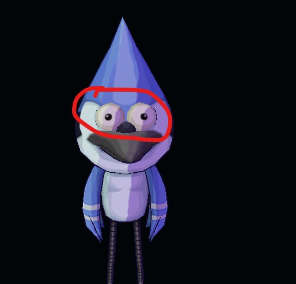

# Bug 32 — Чёрная обводка вокруг глаз Nano Мордекая

**Приоритет:** P2. **Статус:** исправлен и принят в полном offline-клиенте 2026-10-01. T057 закрыт.

## Объём и свидетельства

- [T057](../../source-list.md#t057) — Добавить чёрные линии вокруг глаз нано Мордекая и он будет даже норм

Общий cel и контур Мордекая, Титана и Ван Клайса уже исправлены. Новая задача только о глазах Мордекая, отмеченных красным на примере; Дарвин исключён.

[Предыдущая карточка и результаты](../2026-09-30/bug-032.md). Прежние исправленные части не входят в активный объём.

## Точки входа

- [crates/ffone-client/src/rendering/legacy_model_material](../../../../crates/ffone-client/src/rendering/legacy_model_material)
- [assets/game/characters/nanos/nano_mordecai](../../../../assets/game/characters/nanos/nano_mordecai)

Сначала поиск символов, затем чтение совпавших диапазонов. Для серверного результата найти владельца в `../RustyFusion` и прочитать его AGENTS.md перед изменением. Контракты и порядок выполнения — в [AGENTS.md](../../AGENTS.md).

## Задание агенту

Найти материалы и геометрию глаз; обеспечить чёрную линию именно вокруг обоих глаз средствами native shader/material pass. Общего внешнего силуэта модели недостаточно. Проверить skinning, глубину и толщину линии в нескольких ракурсах/масштабах.

## Критерий готовности и проверка

Граница обоих глаз отчётливо чёрная в живом клиенте, без закрашивания белков, артефактов глубины или ухудшения контура тела.

Проверить только затронутый сценарий и подходящие уникальные регрессии. Для новых UI/графики/анимаций/аудио нужен реальный клиент; для обмена/удалённого аватара — два клиента и сервер. Нулевой набор тестов не подтверждает результат. Если необходимый запуск недоступен, явно оставить живую приёмку неподтверждённой.

## Результат выполнения

2026-10-01. Мордекай — Nano 64, `nano_mordecai`; полный offline-клиент,
сцена получения Nano и выбора силы, анимации `stand3`/`skill1`. До исправления
белки видны, но граница глаз остаётся слабой и прерывистой.

Причина: оба глазных полушария входят в общий материал тела. Инвертированный
outline hull строит силуэт, но его край перекрывается окружающей головой;
внутренняя граница глаза не получает сплошную чёрную линию.

120 исходных треугольников обоих глаз выделены в отдельный primitive/material
`nano_mordecai-eyes` с `nativeInkRim: true`. Surface shader добавляет чёрный
край по углу skinned normal к камере, со сглаживанием через производные.
Центр сохраняет исходную текстуру и cel shading. Blend/depth/cull, исходный
материал тела и его outline не изменены; размер GPU uniform сохранён.
Исходный BIN сохранён как префикс: позиции, UV, normals, joints/weights,
иерархия, inverse bind matrices, 28 анимаций и все PNG/mips неизменны.

Изменены GLB Мордекая; `legacy_model_material/{params.rs,metadata.rs,
material_uniforms.rs,legacy_model_base.wgsl,tests/native_nano_outlines.rs}`;
native asset contract. Добавлена регрессия на обе глазные группы,
неизменность исходных треугольников/порядка вершин и ограничение эффекта
отдельным материалом.

Проверено: исходный полный клиент прошёл получение/выбор силы/`ResultSkill`
и закрытие; GPU preview исходной модели с `stand1` загружает rig и 9 mip levels
без ошибок материала/шейдера. Байтовое сравнение подтверждает сохранение
исходного BIN и JSON nodes/skins/animations/images/textures/samplers.
Новый полный клиент (exe 2026-10-01 11:39:40 и финальная сборка 11:49:16,
RTX 3060/Vulkan) прошёл
`CameraApproach`/`call`, `PowerSelection`/`stand1`, `ResultSkill`/`skill1` и
закрытие; exit 0. Оба глаза имеют чёрный край, белки/зрачки сохранены,
артефактов глубины на осмотренных кадрах нет. Сохранены
[выбор силы](../../evidence/2026-10-01/bug-032/client-power-selection.png) и
[skill1](../../evidence/2026-10-01/bug-032/client-skill1.png).

`ffone_client-300cdf94d89a9153.exe rendering::legacy_model_material::tests
--nocapture`: **71 passed**, включая 2 `native_nano_outlines`. Проверены
parse/render state, mip/sampler contracts, оба глаза и прежние Nano-outline.
`cargo build -p ffone-client --example logical_model_gpu_preview --bin
ffone-client --features diagnostics --locked`: **PASS**. Крупные GPU-ракурсы
`-z/stand1`, `reverse/skill1`, `-x/stand3`, midpoint: материал/шейдер без ошибок,
2 skinned primitives, 28 анимаций, обе полные 9-уровневые mip chains.
[Фронтальный кадр](../../evidence/2026-10-01/bug-032/gpu-front.png): края обоих глаз
чёрные, белки/зрачки не закрашены; в косом/боковом ракурсах линия остаётся
на поверхности видимого глаза. Контур тела сохранён. Адресный
`git diff --check` прошёл.

Ограничение preview: первый фронтальный захват показал только outline hull при
JSON status=success; повтор тех же параметров показал полную поверхность.
Этот первый кадр не считается визуальным PASS. В двух полных клиентских
запусках симптом не наблюдался. FPS не оценивается: одновременно шли чужие сборки.

T057 закрыт. Серверное получение Nano не входит
в визуальную приёмку; offline fixture подставляет подтверждение выбора силы.
