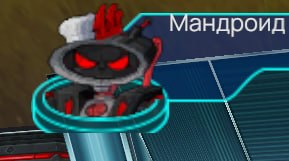
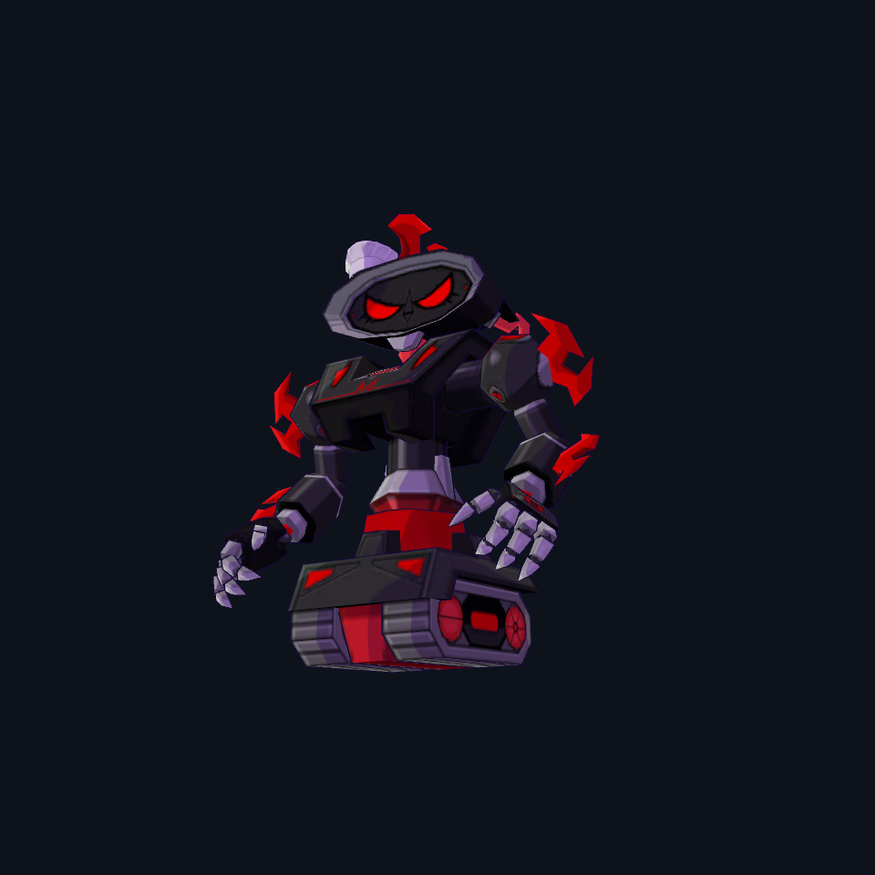

# Bug 34 — Положение шапки Crocpot Mandroid

**Приоритет:** P2. **Статус:** asset-fixed 2026-10-01; T008 снят с активной очереди. Полная игровая приёмка не подтверждена.

## Объём и свидетельства

- [T008](../../source-list.md#t008) — У Кропкотера (Мандроида) на корабле Мэндарка, судя по иконке, должна быть модель с шапочкой. Почти %) У него сбоку шапочка была

Шапка уже добавлена 2026-09-27. Активно её положение; костюм банкира 2586 и очки бухгалтера 2587 исключены по записанным исправлениям.

[Предыдущая карточка и результаты](../2026-09-30/bug-034.md). Прежние исправленные части не входят в активный объём.

## Точки входа

- [assets/game/characters](../../../../assets/game/characters)
- [assets/game/data/tables](../../../../assets/game/data/tables)
- [crates/ffone-client/src/characters](../../../../crates/ffone-client/src/characters)

Сначала поиск символов, затем чтение совпавших диапазонов. Для серверного результата найти владельца в `../RustyFusion` и прочитать его AGENTS.md перед изменением. Контракты и порядок выполнения — в [AGENTS.md](../../AGENTS.md).

## Задание агенту

Для Mandroid M-110, instance 3206, проверить отдельную npc_mandroid_chef и attachment шапки на голове. Сверить локальное смещение/поворот/масштаб с пользовательским примером и портретом: шапка должна сидеть сбоку. Проверить статику и stand1, а также используемую иконку.

## Критерий готовности и проверка

Шапка стоит как на примере, сохраняет положение при анимации и в портрете; прочие Mandroid не меняются.

Проверить только затронутый сценарий и подходящие уникальные регрессии. Для новых UI/графики/анимаций/аудио нужен реальный клиент; для обмена/удалённого аватара — два клиента и сервер. Нулевой набор тестов не подтверждает результат. Если необходимый запуск недоступен, явно оставить живую приёмку неподтверждённой.

## Результат 2026-10-01

- Воспроизведение: NPC type 3206, Mandroid M-110 на корабле Мэндарка; маршрут `npc_mandroid_chef`, scale 1, body texture `npc_mandroid1`, icon index 721 → `npcicon_1784.png`. GPU-кадр до изменения показал большую шапку по центру над красным гребнем, с зазором над головой.
- Причина: неверные authored TRS узла `Mandroid M-110 chef hat`. Его исходная позиция в пространстве модели [0, 1.6, -0.03] и scale 1.8 ставили шапку слишком высоко и по центру. Материал, анимации и NPC route уже работали.
- Исправление: изменён только TRS узла шапки в [npc_mandroid_chef.glb](../../../../assets/game/characters/shared/npc_mandroid1/npc_mandroid_chef.glb). Позиция в пространстве модели [-0.22, 1.36, -0.03], scale 0.7, наклон 10° к краю головы. Локальные TRS записаны относительно `Bip01 Head` в GLB. Шапка остаётся дочерним узлом головы, поэтому следует за `stand1`. Прочие Mandroid не менялись.
- Адресная проверка существующего production route test на `target/debug/deps/ffone_client-d952fc4e5a1f90fb.exe`: **1 passed**. NPC 3206 выбирает chef GLB, NPC 2498 сохраняет обычный GLB. Этот исполняемый тест уже собран ранее; нового Rust-кода в исправлении нет. Повтор через Cargo отменён во время ожидания занятого build lock.
- GLB сравнен с исходным LFS объектом HEAD: изменён только узел шапки; BIN, геометрия, материалы, текстуры, rig и 13 клипов идентичны. Узел 50 остаётся дочерним узлом 19 (`Bip01 Head`), прямых animation channels на attachment нет.
- `logical_model_gpu_preview.exe`: статика и середина `stand1` — **success**, 2 meshes/2 materials, 0 material/shader errors; `stand1` оценён на 69 кадрах. Оба итоговых кадра осмотрены и сопоставлены с пользовательским примером и штатной иконкой. Иконка уже имеет шапку сбоку и сохранена.
- Полный `target/debug/ffone-client.exe` от 2026-10-01 11:27 запущен дважды на корабле, RU 1920×1080, offline NPC ingress, **оба exit 0**. Кадры и отчёты: `target/bug-034/client/` и `target/bug-034/client-close/`. Локация загрузилась, но первый ракурс закрыл близкого NPC персонажем/геометрией, а frozen-ракурс — эффектом. Эти кадры не подтверждают точную посадку шапки в игровой сессии; интерактивный портрет/серверная сессия не проверены. Полная живая приёмка остаётся неподтверждённой.
- **T008:** asset-fixed, снят из активной очереди согласно правилу исключения конкретных исправлений. Прежние исправления банкира/бухгалтера не пересматривались.

